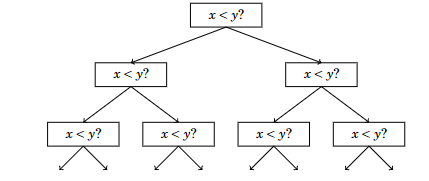

## Ordenamiento

El ordenamiento es un problema fundamental en el diseño de algoritmos. Muchos algoritmos eficientes utilizan el ordenamiento como una subrutina, ya que a menudo es más fácil procesar los datos si los elementos están en un orden ordenado.

Por ejemplo, el problema "¿contiene un array dos elementos iguales?" es fácil de resolver utilizando el ordenamiento. Si el array contiene dos elementos iguales, estarán uno al lado del otro después del ordenamiento, por lo que es fácil encontrarlos. De manera similar, el problema "¿cuál es el elemento más frecuente en un array?" también se puede resolver de esta manera.

Existen muchos algoritmos para el ordenamiento, y también son buenos ejemplos de cómo aplicar diferentes técnicas de diseño de algoritmos. Los algoritmos de ordenamiento generales eficientes funcionan en tiempo O(n log n), y muchos algoritmos que utilizan el ordenamiento como subrutina también tienen esta complejidad temporal.

### Teoría del Ordenamiento

El problema básico en el ordenamiento es el siguiente:

Dado un array que contiene `n` elementos, tu tarea es ordenar los elementos en orden ascendente.

Por ejemplo, el array

`1 3 8 2 9 2 5 6`

se verá así después del ordenamiento:

`1 2 2 3 5 6 8 9`

### Algoritmos O(n²)

Los algoritmos simples para ordenar un array funcionan en tiempo O(n²). Tales algoritmos son cortos y generalmente consisten en dos bucles anidados. Un famoso algoritmo de ordenamiento con tiempo O(n²) es el **ordenamiento por burbuja** (bubble sort).

Bubble sort consta de `n` rondas. En cada ronda, el algoritmo itera a través de los elementos del array. Siempre que se encuentren dos elementos consecutivos que no estén en el orden correcto, el algoritmo los intercambia. El algoritmo se puede implementar de la siguiente manera:

```cpp
for (int i = 0; i < n; i++) {
    for (int j = 0; j < n-1; j++) {
        if (array[j] > array[j+1]) {
            swap(array[j], array[j+1]);
        }
    }
}
```

Después de la primera ronda del algoritmo, el elemento más grande estará en la posición correcta, y en general, después de `k` rondas, los `k` elementos más grandes estarán en las posiciones correctas. Así, después de `n` rondas, todo el array estará ordenado.

Por ejemplo, en el array:

`1 3 8 2 9 2 5 6`

la primera ronda del ordenamiento por burbuja intercambia elementos como sigue:

`1 3 2 8 9 2 5 6`

`1 3 2 8 2 9 5 6`

`1 3 2 8 2 5 9 6`

`1 3 2 8 2 5 6 9`

### Inversiones

El ordenamiento por burbuja es un ejemplo de un algoritmo de ordenamiento que siempre intercambia elementos consecutivos en el array. Resulta que la complejidad temporal de tal algoritmo siempre es al menos O(n²), ya que en el peor caso, se requieren O(n²) intercambios para ordenar el array.

Un concepto útil al analizar algoritmos de ordenamiento es una **inversión**: un par de elementos del array `(array[a], array[b])` tal que `a < b` y `array[a] > array[b]`, es decir, los elementos están en el orden incorrecto.

El array `2 2 6 3 5 9 8` tiene tres inversiones: `(6, 3)`, `(6, 5)` y `(9, 8)`. El número de inversiones indica cuánto trabajo se necesita para ordenar el array. Un array está completamente ordenado cuando no hay inversiones. Por otro lado, si los elementos del array están en orden inverso, el número de inversiones es el mayor posible:

$$
1 + 2 + · · · + (n − 1) = n(n − 1) / 2 = O(n²)
$$


Intercambiar un par de elementos consecutivos que están en el orden incorrecto elimina exactamente una inversión del array. Por lo tanto, si un algoritmo de ordenamiento solo puede intercambiar elementos consecutivos, cada intercambio elimina como máximo una inversión, y la complejidad temporal del algoritmo es al menos O(n²).

### Algoritmos O(n log n)

Es posible ordenar un array de manera eficiente en O(n log n) utilizando algoritmos que no están limitados a intercambiar elementos consecutivos. Uno de estos algoritmos es el **ordenamiento por mezcla** (merge sort), que se basa en la recursión.

El ordenamiento por mezcla clasifica un subarray `array[a . . . b]` de la siguiente manera:
1. Si `a = b`, no se hace nada, ya que el subarray ya está ordenado.
2. Calcula la posición del elemento medio: `k = ⌊(a + b) / 2⌋`.
3. Ordena recursivamente el subarray `array[a . . . k]`.
4. Ordena recursivamente el subarray `array[k + 1 . . . b]`.
5. Combina los subarrays ordenados `array[a . . . k]` y `array[k + 1 . . . b]` en un subarray ordenado `array[a . . . b]`.

El ordenamiento por mezcla es un algoritmo eficiente, porque reduce el tamaño del subarray a la mitad en cada paso. La recursión consiste en O(log n) niveles, y procesar cada nivel toma O(n) tiempo. Combinar los subarrays `array[a . . . k]` y `array[k + 1 . . . b]` es posible en tiempo lineal, ya que ya están ordenados.

Por ejemplo, considere ordenar el siguiente array:

`1 3 6 2 8 2 5 9`

El array se dividirá en dos subarrays como sigue:

`1 3 6 2` `8 2 5 9`


Luego, los subarrays serán ordenados recursivamente como sigue:

`1 2 3 6`  `2 5 8 9`

Finalmente, el algoritmo combina los subarrays ordenados y crea el array final ordenado:

`1 2 2 3 5 6 8 9`


### Límite Inferior para el Ordenamiento

¿Es posible ordenar un array más rápido que en O(n log n)? Resulta que esto no es posible cuando nos restringimos a algoritmos de ordenamiento basados en la comparación de elementos del array.

El límite inferior para la complejidad temporal se puede demostrar considerando el ordenamiento como un proceso en el que cada comparación de dos elementos da más información sobre el contenido del array. El proceso crea el siguiente árbol:



Aquí "x < y?" significa que se comparan algunos elementos x e y. Si x < y, el proceso continúa a la izquierda; de lo contrario, a la derecha. Los resultados del proceso son las posibles formas de ordenar el arreglo, un total de n! formas. Por esta razón, la altura del árbol debe ser al menos

$$
\log_2(n!) = \log_2(1) + \log_2(2) + \cdots + \log_2(n)
$$

Obtenemos un límite inferior para esta suma al elegir los últimos n/2 elementos y cambiar el valor de cada elemento a $\log_2(n/2)$. Esto da una estimación

$$
\log_2(n!) \geq \frac{n}{2} \cdot \log_2\left(\frac{n}{2}\right)
$$

por lo que la altura del árbol y el número mínimo posible de pasos en un algoritmo de ordenamiento en el peor caso es al menos n log n.

### Ordenamiento por conteo

El límite inferior n log n no se aplica a algoritmos que no comparan elementos del arreglo, sino que utilizan alguna otra información. Un ejemplo de tal algoritmo es el **ordenamiento por conteo**, que ordena un arreglo en O(n) tiempo asumiendo que cada elemento en el arreglo es un entero entre 0 y c, y c = O(n).

El algoritmo crea un arreglo de control, cuyos índices son elementos del arreglo original. El algoritmo itera a través del arreglo original y calcula cuántas veces aparece cada elemento en el arreglo.

Por ejemplo, el arreglo

`1 3 6 9 9 3 5 9`


corresponde al siguiente arreglo de contabilidad:

```code
Índices:  0  1  2  3  4  5  6  7  8
Valores:  1  0  2  0  1  1  0  0  3
```


Por ejemplo, el valor en la posición 3 en el arreglo de contabilidad es 2, porque el elemento 3 aparece 2 veces en el arreglo original.

La construcción del arreglo de contabilidad toma un tiempo de O(n). Después de esto, el arreglo ordenado se puede crear en tiempo O(n) porque el número de ocurrencias de cada elemento se puede recuperar del arreglo de contabilidad. Por lo tanto, la complejidad total de tiempo de el ordenamiento por conteo es O(n).

El ordenamiento por conteo es un algoritmo muy eficiente pero solo se puede usar cuando la constante c es lo suficientemente pequeña, de modo que los elementos del arreglo puedan usarse como índices en el arreglo de contabilidad.

## Navegación
- [Siguiente: Ordenamiento en C++.md](./Ordenamiento%20en%20C%2B%2B.md)
