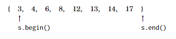

# Iteradores y Rangos

Muchas funciones en la biblioteca estándar de C++ operan con iteradores. Un iterador es una variable que apunta a un elemento en una estructura de datos.

Los iteradores frecuentemente usados `begin` y `end` definen un rango que contiene todos los elementos en una estructura de datos. El iterador `begin` apunta al primer elemento en la estructura de datos, y el iterador `end` apunta a la posición después del último elemento. La situación se ve como sigue:




Nota la asimetría en los iteradores: `s.begin()` apunta a un elemento en la estructura de datos, mientras que `s.end()` apunta fuera de la estructura de datos. Así, el rango definido por los iteradores es semi-abierto.

## Trabajando con Rangos

Los iteradores se usan en funciones de la biblioteca estándar de C++ que reciben un rango de elementos en una estructura de datos. Usualmente, queremos procesar todos los elementos en una estructura de datos, por lo que se proporcionan los iteradores `begin` y `end` a la función.

Por ejemplo, el siguiente código ordena un vector usando la función `sort`, luego invierte el orden de los elementos usando la función `reverse`, y finalmente baraja el orden de los elementos usando la función `random_shuffle`:

```cpp
vector<int> v = {3, 4, 6, 8, 12, 13, 14, 17};
sort(v.begin(), v.end());
reverse(v.begin(), v.end());
random_shuffle(v.begin(), v.end());
```

Estas funciones también se pueden usar con un arreglo ordinario. En este caso, las funciones reciben punteros al arreglo en lugar de iteradores:

```cpp
sort(a, a+n);
reverse(a, a+n);
random_shuffle(a, a+n);
```

# Iteradores de Conjuntos

Los iteradores se usan a menudo para acceder a los elementos de un conjunto. El siguiente código crea un iterador `it` que apunta al elemento más pequeño en un conjunto:

```cpp
set<int> s = {2, 5, 6, 8};
set<int>::iterator it = s.begin();
```

Forma más corta de escribir el código

```cpp
auto it = s.begin();
```

El elemento al que apunta un iterador se puede acceder usando el símbolo `*`. Por ejemplo, el siguiente código imprime el primer elemento en el conjunto:

```cpp
auto it = s.begin();
cout << *it << "\n";
```

Los iteradores se pueden mover utilizando los operadores `++` (adelante) y `--` (atrás), lo que significa que el iterador se mueve al siguiente o al elemento anterior en el conjunto. El siguiente código imprime todos los elementos en orden ascendente:

```cpp
for (auto it = s.begin(); it != s.end(); it++) {
    cout << *it << "\n";
}
```

El siguiente código imprime el elemento más grande en el conjunto:

```cpp
auto it = s.end(); 
it--; // Mover el iterador al último elemento
cout << *it << "\n";
```

La función find(x) devuelve un iterador que apunta a un elemento cuyo valor es x. Sin embargo, si el conjunto no contiene x, el iterador será end.

```cpp
auto it = s.find(x);
if (it == s.end()) {
    // x no se encuentra
}
```

La función lower_bound(x) devuelve un iterador al elemento más pequeño en el conjunto cuyo valor es al menos x, y la función upper_bound(x) devuelve un iterador al elemento más pequeño en el conjunto cuyo valor es mayor que x. En ambas funciones, si tal elemento no existe, el valor de retorno es end. Estas funciones no están soportadas por la estructura unordered_set, que no mantiene el orden de los elementos.

Por ejemplo, el siguiente código encuentra el elemento más cercano a `x`:

```cpp
auto it = s.lower_bound(x);
if (it == s.begin()) {
    cout << *it << "\n";
} else if (it == s.end()) {
    it--;
    cout << *it << "\n";
} else {
    int a = *it; 
    it--;
    int b = *it;
    if (x - b < a - x) 
        cout << b << "\n";
    else 
        cout << a << "\n";
}
```

El código asume que el conjunto no está vacío y recorre todos los casos posibles usando un iterador it. Primero, el iterador apunta al elemento más pequeño cuyo valor es al menos x. Si es igual a begin, el elemento correspondiente es el más cercano a x. Si es igual a end, el elemento más grande en el conjunto es el más cercano a x. Si ninguno de los casos anteriores se cumple, el elemento más cercano a x es el elemento que corresponde a it o el elemento anterior a it.

## Navegación
- [Anterior: Estructuras map.md](./Estructuras%20map.md)
- [Siguiente: Otras estructuras.md](./Otras%20estructuras.md)
