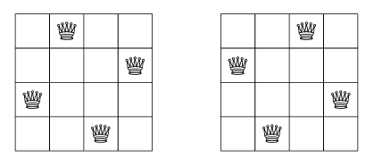
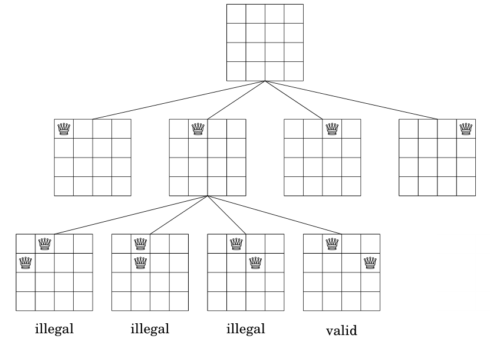

## Backtracking

Un algoritmo de backtracking comienza con una solución vacía y extiende la solución paso a paso. La búsqueda recursivamente explora todas las diferentes formas en que se puede construir una solución.

Como ejemplo, consideremos el problema de calcular el número de formas en que *n* reinas pueden colocarse en un tablero de ajedrez de *n* x *n* de manera que ninguna de las reinas se ataque entre sí. Por ejemplo, cuando *n = 4*, hay dos soluciones posibles:

El problema puede resolverse usando backtracking colocando reinas en el tablero fila por fila. Más precisamente, se colocará exactamente una reina en cada fila de manera que ninguna reina ataque a las reinas colocadas previamente. Se ha encontrado una solución cuando las *n* reinas se han colocado en el tablero.

Por ejemplo, cuando *n = 4*, algunas soluciones parciales generadas por el algoritmo de backtracking son las siguientes:



El problema puede resolverse usando backtracking colocando reinas en el tablero fila por fila. Más precisamente, se colocará exactamente una reina en cada fila de manera que ninguna reina ataque a las reinas colocadas previamente. Se ha encontrado una solución cuando se han colocado todas las *n* reinas en el tablero.

Por ejemplo, cuando *n = 4*, algunas soluciones parciales generadas por el algoritmo de backtracking son las siguientes:



El problema puede resolverse usando backtracking colocando reinas en el tablero fila por fila. Más precisamente, se colocará exactamente una reina en cada fila de manera que ninguna reina ataque a las reinas colocadas previamente. Se ha encontrado una solución cuando se han colocado todas las *n* reinas en el tablero.

Por ejemplo, cuando *n = 4*, algunas soluciones parciales generadas por el algoritmo de backtracking son las siguientes:

```cpp
void search(int y){
    if(y == n){
        count++;
    }
    else{
        for(int x = 0, x < n; x++){
            if(column[x] || diag1[x + y] || diag2[x - y + n -1]) continue;
            column[x] = diag1[x + y] = diag2[x - y + n -1] = 1;
            search(y+1);
            column[x] = diag1[x + y] = diag2[x - y + n -1] = 0;           
        }
    }
}
```

La búsqueda comienza llamando a `search(0)`. El tamaño del tablero es *n* x *n*, y el código calcula el número de soluciones en la variable `count`.

El código asume que las filas y columnas del tablero están numeradas de 0 a *n-1*. Cuando se llama a la función `search` con el parámetro `y`, se coloca una reina en la fila `y` y luego se llama a sí misma con el parámetro `y + 1`. Luego, si `y = n`, se ha encontrado una solución y la variable `count` se incrementa en uno.

El array `column` realiza un seguimiento de las columnas que contienen una reina, y los arrays `diag1` y `diag2` realizan un seguimiento de las diagonales. No se permite añadir otra reina a una columna o diagonal que ya contenga una reina. Por ejemplo, las columnas y diagonales del tablero de 4 x 4 están numeradas de la siguiente manera:


Sea `q(n)` el número de formas de colocar *n* reinas en un tablero de ajedrez de *n* x *n*. El algoritmo de backtracking anterior nos dice que, por ejemplo, `q(8) = 92`. Cuando *n* aumenta, la búsqueda se vuelve rápidamente lenta, porque el número de soluciones aumenta exponencialmente. Por ejemplo, calcular `q(16) = 14,772,512` utilizando el algoritmo anterior ya tarda aproximadamente un minuto en una computadora moderna.

## Navegación

- [Anterior: Generando Permutaciones.md](./Generando%20permutaciones.md)
- [Siguiente: Pruning the Search.md](./Pruning%20the%20Search.md)
