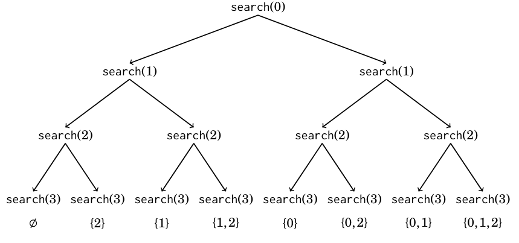

## Búsqueda Completa

La búsqueda completa es un método general que puede usarse para resolver casi cualquier problema algorítmico. La idea es generar todas las posibles soluciones al problema utilizando fuerza bruta, y luego seleccionar la mejor solución o contar el número de soluciones, dependiendo del problema.

La búsqueda completa es una buena técnica si hay suficiente tiempo para recorrer todas las soluciones, ya que la búsqueda suele ser fácil de implementar y siempre da la respuesta correcta. Si la búsqueda completa es demasiado lenta, pueden ser necesarias otras técnicas, como algoritmos voraces o programación dinámica.

### Generación de subconjuntos

Primero consideramos el problema de generar todos los subconjuntos de un conjunto de *n* elementos. Por ejemplo, los subconjuntos de {0,1,2} son , {0}, {1}, {2}, {0,1}, {0,2}, {1,2} y {0,1,2}. 

Hay dos métodos comunes para generar subconjuntos: podemos realizar una búsqueda recursiva o explotar la representación binaria de los enteros.

#### Método 1

Una forma elegante de recorrer todos los subconjuntos de un conjunto es usar la recursión. La siguiente función `search` genera los subconjuntos del conjunto {0,1,...,n-1}. La función mantiene un vector `subset` que contendrá los elementos de cada subconjunto. La búsqueda comienza cuando la función se llama con el parámetro 0.

```cpp
void search(int k){
    if(k == n){
        return
    }
    else{
        search(k + 1);
        subsets.push_back(k);
        search(k + 1);
        subsets.pop_back();
    }
}
```

Cuando se llama a la función `search` con el parámetro `k`, decide si incluir o no el elemento `k` en el subconjunto y, en ambos casos, luego se llama a sí misma con el parámetro `k + 1`. Sin embargo, si `k = n`, la función nota que todos los elementos han sido procesados y se ha generado un subconjunto.

El siguiente árbol ilustra las llamadas a la función cuando `n = 3`. Siempre podemos elegir la rama izquierda (el elemento `k` no se incluye en el subconjunto) o la rama derecha (el elemento `k` se incluye en el subconjunto).



#### Método 2

Otra forma de generar subconjuntos se basa en la representación binaria de los enteros. Cada subconjunto de un conjunto de *n* elementos puede representarse como una secuencia de *n* bits, que corresponde a un entero entre 0 y $2^n - 1$. Los unos en la secuencia de bits indican qué elementos están incluidos en el subconjunto.

La convención habitual es que el último bit corresponde al elemento 0, el penúltimo bit corresponde al elemento 1, y así sucesivamente. Por ejemplo, la representación binaria de 25 es 11001, lo que corresponde al subconjunto {0,3,4}.

El siguiente código recorre los subconjuntos de un conjunto de *n* elementos:

```cpp
for(int i = 0; i < (i<<b); i++){
    ///
}
```

El siguiente código muestra cómo podemos encontrar los elementos de un subconjunto que corresponde a una secuencia de bits. Al procesar cada subconjunto, el código construye un vector que contiene los elementos del subconjunto.

```cpp
for(int i = 0; i < (i<<b); i++){
    vector<int>subsets;

    for(int j = 0; j < b ; j++){
        if(i & (1<<j)){
            subsets.push_back(j);
        }
    }
}
```

## Navegación

- [Siguiente: Generando Permutaciones.md](./Generando%20Permutaciones.md)
