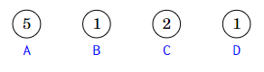
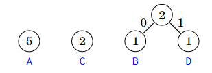
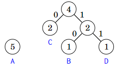
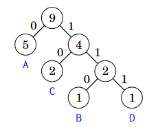

# Compresión de Datos

Un código binario asigna a cada carácter de una cadena una palabra de código que consiste en bits. Podemos comprimir la cadena utilizando el código binario reemplazando cada carácter por la palabra de código correspondiente. Por ejemplo, el siguiente código binario asigna palabras de código para los caracteres A–D:

| Carácter | Palabra de código |
|----------|-------------------|
| A        | 00                |
| B        | 01                |
| C        | 10                |
| D        | 11                |

Este es un código de longitud constante, lo que significa que la longitud de cada palabra de código es la misma. Por ejemplo, podemos comprimir la cadena **AABACDACA** de la siguiente manera:

$$
00 \, 00 \, 01 \, 00 \, 10 \, 11 \, 00 \, 10 \, 00
$$

Usando este código, la longitud de la cadena comprimida es de 18 bits. Sin embargo, podemos comprimir la cadena mejor si usamos un código de longitud variable donde las palabras de código pueden tener diferentes longitudes. De esta manera, podemos asignar palabras de código cortas para caracteres que aparecen con frecuencia y palabras de código largas para caracteres que aparecen raramente. Resulta que un código óptimo para la cadena anterior es el siguiente:

| Carácter | Palabra de código |
|----------|-------------------|
| A        | 0                 |
| B        | 110               |
| C        | 10                |
| D        | 111               |

Un código óptimo produce una cadena comprimida que es lo más corta posible. En este caso, la cadena comprimida usando el código óptimo es:

$$
0 \, 0 \, 110 \, 0 \, 10 \, 111 \, 0 \, 10 \, 0,
$$

por lo que solo se necesitan 15 bits en lugar de 18 bits. Así, gracias a un mejor código, fue posible ahorrar 3 bits en la cadena comprimida.

Requerimos que ninguna palabra de código sea prefijo de otra palabra de código. Por ejemplo, no se permite que un código contenga tanto las palabras de código **10** y **1011**. La razón de esto es que queremos poder generar la cadena original a partir de la cadena comprimida. Si una palabra de código pudiera ser prefijo de otra palabra de código, esto no siempre sería posible. Por ejemplo, el siguiente código no es válido:

| Carácter | Palabra de código |
|----------|-------------------|
| A        | 10                |
| B        | 11                |
| C        | 1011              |
| D        | 111               |

Usando este código, no sería posible saber si la cadena comprimida **1011** corresponde a la cadena **AB** o a la cadena **C**.

## Codificación de Huffman

La **codificación de Huffman** es un algoritmo voraz que construye un código óptimo para comprimir una cadena dada. El algoritmo construye un árbol binario basado en las frecuencias de los caracteres en la cadena, y la palabra de código de cada carácter se puede leer siguiendo un camino desde la raíz hasta el nodo correspondiente. Un movimiento a la izquierda corresponde al bit **0**, y un movimiento a la derecha corresponde al bit **1**.

Inicialmente, cada carácter de la cadena se representa mediante un nodo cuyo peso es el número de veces que el carácter aparece en la cadena. Luego, en cada paso, se combinan dos nodos con pesos mínimos creando un nuevo nodo cuyo peso es la suma de los pesos de los nodos originales. El proceso continúa hasta que todos los nodos se han combinado.

A continuación, veremos cómo la codificación de Huffman crea el código óptimo para la cadena **AABACDACA**. Inicialmente, hay cuatro nodos que corresponden a los caracteres de la cadena:

El nodo que representa el carácter **A** tiene un peso de **5** porque el carácter **A** aparece 5 veces en la cadena. Los otros pesos se han calculado de la misma manera.

El primer paso es combinar los nodos que corresponden a los caracteres **B** y **D**, ambos con peso **1**. El resultado es:

Después de esto, se combinan los nodos con peso **2**:

Finalmente, se combinan los dos nodos restantes:

Ahora todos los nodos están en el árbol, por lo que el código está listo. Las siguientes palabras de código se pueden leer del árbol:

| Carácter | Palabra de código |
|----------|-------------------|
| A        | 0                 |
| B        | 110               |
| C        | 10                |
| D        | 111               |

## Navegación

- [Anterior: Minimizacion de sumas.md](./Minimizando%20sumas.md)