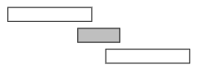
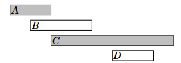
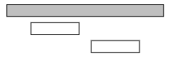
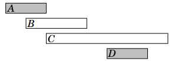

# Programación de Tareas

Muchos problemas de programación de tareas pueden resolverse utilizando algoritmos voraces. Un problema clásico es el siguiente: Dados \(n\) eventos con sus tiempos de inicio y finalización, encontrar una programación que incluya la mayor cantidad de eventos posible. No es posible seleccionar un evento de forma parcial. Por ejemplo, considera los siguientes eventos:

| Evento | Hora de inicio | Hora de finalización |
|--------|----------------|----------------------|
| A      | 1              | 3                    |
| B      | 2              | 5                    |
| C      | 3              | 9                    |
| D      | 6              | 8                    |

En este caso, el número máximo de eventos es dos. Por ejemplo, podemos seleccionar los eventos B y D de la siguiente manera:

Es posible inventar varios algoritmos voraces para el problema, pero ¿cuál de ellos funciona en todos los casos?

### Algoritmo 1

La primera idea es seleccionar los eventos más cortos posibles. En el caso del ejemplo, este algoritmo selecciona los siguientes eventos:

Sin embargo, seleccionar los eventos más cortos no siempre es una estrategia correcta. Por ejemplo, el algoritmo falla en el siguiente caso:

Si seleccionamos el evento más corto, solo podemos seleccionar un evento. Sin embargo, sería posible seleccionar ambos eventos largos.

### Algoritmo 2

Otra idea es siempre seleccionar el siguiente evento posible que comience lo antes posible. Este algoritmo selecciona los siguientes eventos:

Sin embargo, también podemos encontrar un contraejemplo para este algoritmo. Por ejemplo, en el siguiente caso, el algoritmo solo selecciona un evento:

Si seleccionamos el primer evento, no es posible seleccionar ningún otro evento. Sin embargo, sería posible seleccionar los otros dos eventos.

### Algoritmo 3

La tercera idea es siempre seleccionar el siguiente evento posible que termine lo antes posible. Este algoritmo selecciona los siguientes eventos:

Resulta que este algoritmo siempre produce una solución óptima. La razón de esto es que siempre es una elección óptima seleccionar primero un evento que termine lo antes posible. Después de esto, es una elección óptima seleccionar el siguiente evento utilizando la misma estrategia, y así sucesivamente, hasta que no podamos seleccionar más eventos.

Una forma de argumentar que el algoritmo funciona es considerar qué sucede si primero seleccionamos un evento que termina más tarde que el evento que termina lo antes posible. En este caso, tendremos como máximo el mismo número de opciones de cómo podemos seleccionar el siguiente evento. Por lo tanto, seleccionar un evento que termine más tarde nunca puede generar una mejor solución, y el algoritmo voraz es correcto.

## Navegación

- [Anterior: Problema de la moneda.md](./Problema%20de%20la%20moneda.md)
- [Siguiente: Tareas y plazos.md](./Tareas%20y%20plazos.md)