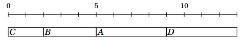
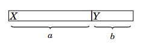
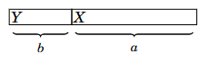

# Tareas y Plazos

Consideremos ahora un problema en el que se nos dan \(n\) tareas con duraciones y plazos, y nuestra tarea es elegir un orden para realizarlas. Para cada tarea, ganamos \(d - x\) puntos, donde \(d\) es el plazo de la tarea y \(x\) es el momento en que terminamos la tarea. ¿Cuál es el mayor puntaje total posible que podemos obtener?

Por ejemplo, supongamos que las tareas son las siguientes:

| Tarea | Duración | Plazo |
|-------|----------|-------|
| A     | 4        | 2     |
| B     | 3        | 5     |
| C     | 2        | 7     |
| D     | 4        | 5     |

En este caso, una programación óptima para las tareas es la siguiente:

En esta solución, C da 5 puntos, B da 0 puntos, A da -7 puntos y D da -8 puntos, por lo que el puntaje total es -10.

Sorprendentemente, la solución óptima del problema no depende de los plazos en absoluto. Una estrategia voraz correcta es simplemente realizar las tareas ordenadas por su duración en orden creciente. La razón de esto es que si alguna vez realizamos dos tareas una tras otra, de modo que la primera tarea toma más tiempo que la segunda, podemos obtener una mejor solución si intercambiamos las tareas. Por ejemplo, consideremos la siguiente programación:

Aquí, \(a > b\), por lo que deberíamos intercambiar las tareas:

Ahora, X da \(b\) puntos menos y Y da \(a\) puntos más, por lo que el puntaje total aumenta en \(a - b > 0\). En una solución óptima, para cualquier dos tareas consecutivas, debe cumplirse que la tarea más corta venga antes que la tarea más larga. Por lo tanto, las tareas deben realizarse ordenadas por sus duraciones.

## Navegación

- [Anterior: Programacion de tareas.md](./Programacion.md)
- [Siguiente: Minimizando sumas.md](./Minimizando%20sumas.md)